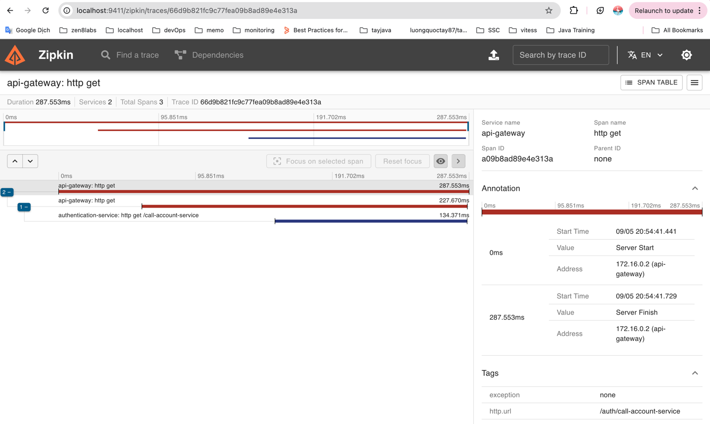

# Thiết Kế codeBase Microservice Theo Mô Hình Của Netflix


Nguồn tham khảo: https://spring.io/cloud


## 1. Discovery server (Service Registry)

- Tạo ___Discovery server___ tại [Spring Initializr](https://start.spring.io/)


- Thêm annotation `@EnableEurekaServer` vào `class DiscoveryServerApplication` để khởi động `Eureka Server`
```java
@SpringBootApplication
@EnableEurekaServer
public class DiscoveryServerApplication {

	public static void main(String[] args) {
		SpringApplication.run(DiscoveryServerApplication.class, args);
	}

}
```

- Cấu hình `Discovery Server` tại `application.yml`
```yml
server:
  port: 8761

spring:
  application:
    name: discovery-server
  security: # security eureka server by spring security
    user:
      name: ${EUREKA_USER:admin}
      password: ${EUREKA_PASSWORD:password}

eureka: # eureka server info
  client:
    register-with-eureka: false
    fetch-registry: false
  server:
    enable-self-preservation: false

management: # allow show all actuator endpoint
  endpoints:
    web:
      exposure:
        include: '*'

logging: # config logging level
  level:
    com.netflix.eureka: OFF
    com.netflix.discovery: OFF
```

- Cấu hình `Spring Security` cho `Eureka Server`
```java
@Configuration
@EnableWebSecurity
public class SecurityConfig {

    @Bean
    public SecurityFilterChain securityFilterChain(HttpSecurity http) throws Exception {
        http
                .authorizeHttpRequests(authorizeRequests -> authorizeRequests.anyRequest().authenticated())
                .httpBasic(withDefaults());
        http.csrf(AbstractHttpConfigurer::disable);
        return http.build();
    }
}
```

- Khởi động `Discovery Server`
```bash
$ ./mvnw spring-boot:run
```

- Test `Discovery Server` theo URL: http://localhost:8761
```
Thông tin log in vào Eureka server
- username: admin
- password: password
```


---
## 2. API gateway (Cloud gateway)

- Tạo ___API Gateway___ tại [Spring Initializr](https://start.spring.io/)


- Cấu hình `API gateway` tại `application.yml`
```yml
server:
  port: 4953

spring:
  application:
    name: api-gateway
  cloud:
    gateway:
      routes: # điều hướng request đến service tương ứng thông qua chỉ định trên url
        - id: authentication-service
          uri: lb://authentication-service
          predicates:
            - Path=/auth/** # chỉ định url có chứa ký tự /auth
          filters:
            - RewritePath=/auth/(?<segment>.*), /$\{segment} # thay thế ký tự /auth/ thành /
        - id: account-service
          uri: lb://account-service
          predicates:
            - Path=/account/** # chỉ định url có chứa ký tự /account
          filters:
            - RewritePath=/account/(?<segment>.*), /$\{segment} # thay thế ký tự /account/ thành /

management: # cho phép hiển thị thông tin sức khoẻ của service
  endpoints:
    web:
      exposure:
        include: '*'

eureka: # cấu hình eureka client kết nối tới eureka server
  client:
    serviceUrl:
      defaultZone: http://${EUREKA_USER:admin}:${EUREKA_PASSWORD:password}@${DISCOVERY_SERVER:localhost}:8761/eureka
```

- Khởi động `API Gateway`
```bash
$ ./mvnw spring-boot:run
```
> Sau khi khởi động `API Gateway` thành công nó sẽ tự động đăng ký với `Discovery Server` vì trước đó chúng ta đã đăng ký `API Gateway` là client của nó. ___Discovery Server___ sẽ kiểm trả thông tin sức khoẻ của `API Gateway` thông qua Spring Actuator nếu trạng thái là `UP` thì nó sẽ được đăng ký và quản lý bởi `Eureka Server`

- Kiểm tra sức khoẻ của `API Gateway` bằng command line
```bash
$ curl --location 'http://localhost:4953/actuator/health'
{
    "status": "UP"
}
```

- Kiểm tra trạng thái trên [Discover Server](http://localhost:8761/)


---
## 3. Authentication service (microservice)

- Tạo ___Authentication service___ tại [Spring Initializr](https://start.spring.io/)


- Cấu hình `Authentication service` tại `application.yml`
```yml
server:
  port: 8081

spring:
  application:
    name: authentication-service

management: # cho phép hiển thị thông tin sức khoẻ của service
  endpoints:
    web:
      exposure:
        include: '*'

eureka: # cấu hình eureka client kết nối tới eureka server
  client:
    serviceUrl:
      defaultZone: http://${EUREKA_USER:admin}:${EUREKA_PASSWORD:password}@${DISCOVERY_SERVER:localhost}:8761/eureka 
```

- Tạo api `/welcome`
```java
@RestController
public class WelcomeController {

    @GetMapping("/welcome")
    public String welcome() {
        System.out.println("================> Authentication service");
        return "Welcome to authentication service";
    }
}
```

- Kiểm tra sức khoẻ của `Authentication service` bằng command line
```bash
$ curl --location 'http://localhost:8081/actuator/health'

{
    "status": "UP"
}
```

- Kiểm tra trạng thái trên [Discover Server](http://localhost:8761/)


- Test api `/welcome`
```bash
$ curl --location 'http://localhost:8081/welcome'

Welcome to authentication service
```
- Test api `/welcome` với `API Gateway`
```bash
$ curl --location 'http://localhost:4953/auth/welcome'

Welcome to authentication service
```
> API Gateway sẽ điều hướng request `/auth/welcome` tới Authentication service dựa vào từ khoá `/auth/` chứa trong request `http://localhost:4953/auth/welcome`

---
## 4. Account service (microservice)

- Tạo ___Account service___ tại [Spring Initializr](https://start.spring.io/)


- Cấu hình `Account service` tại `application.yml`
```yml
server:
  port: 8082

spring:
  application:
    name: account-service

management: # cho phép hiển thị thông tin sức khoẻ của service
  endpoints:
    web:
      exposure:
        include: '*'

eureka: # cấu hình eureka client kết nối tới eureka server
  client:
    serviceUrl:
      defaultZone: http://${EUREKA_USER:admin}:${EUREKA_PASSWORD:password}@${DISCOVERY_SERVER:localhost}:8761/eureka 
```

- Tạo api `/welcome`
```java
@RestController
public class WelcomeController {

    @GetMapping("/welcome")
    public String welcome() {
        System.out.println("================> Account service");
        return "Welcome to Account service";
    }
}
```

- Kiểm tra sức khoẻ của `Account service` bằng command line
```bash
$ curl --location 'http://localhost:8082/actuator/health'

{
    "status": "UP"
}
```

- Kiểm tra trạng thái trên [Discover Server](http://localhost:8761/)


- Test api `/welcome`
```bash
$ curl --location 'http://localhost:8082/welcome'

Welcome to account service
```
- Test api `/welcome` với `API Gateway`
```bash
$ curl --location 'http://localhost:4953/account/welcome'

Welcome to account service
```
> API Gateway sẽ điều hướng request `/account/welcome` tới Account service dựa vào từ khoá `/account/` chứa trong request `http://localhost:4953/account/welcome`

---
## 5. Circuit Breaker Pattern
### 5.1 Circuit Breaker Pattern là gì ?

> Trong kiến trúc microservices, __Circuit Breaker__ là một mẫu thiết kế được sử dụng để xử lý lỗi có thể xảy ra khi gọi remot service. Mục đích của __Circuit Breaker__ là ngăn chặn một loạt lỗi trong hệ thống phân tán bằng cách cung cấp cơ chế dự phòng khi dịch vụ không khả dụng hoặc gặp sự cố.

- Trạng thái `Closed`
> Ban đầu __Circuit Breaker__ ở trạng thái Closed, cho phép gọi remote service diễn ra bình thường. Ở trạng thái này __Circuit Breaker__ sẽ giám sát hoạt động gọi remote. Nếu gọi thành công nó sẽ reset lại bộ đếm lỗi ngược lại nếu không thành công nó sẽ tắng số lần lỗi.

- Trạng thái `Open`
> Nếu số lần lỗi trong một khoảng thời gian được chỉ định vượt quá ngưỡng được xác định trước, __Circuit Breaker__ sẽ chuyển sang trạng thái `Open`.
Ở trạng thái `Open`, các cuộc gọi tiếp theo đến remote service sẽ bị chặn và __Circuit Breaker__ sẽ ngay lập tức trả về phản hồi dự phòng (fallBack) được xác định trước mà không cố gắng gọi remote service.
Điều này ngăn các cuộc gọi bổ sung làm quá tải dịch vụ đang lỗi và cho phép microservice có thời gian phục hồi.

- Trạng thái `Half-Open`
> Sau một khoảng thời gian nhất định, __Circuit Breaker__ sẽ chuyển sang trạng thái `Half-Open`, cho phép một số lượng cuộc gọi giới hạn đến remote service để kiểm tra xem nó đã phục hồi chưa.
Nếu các cuộc gọi thử nghiệm này thành công, __Circuit Breaker__ sẽ chuyển trở lại trạng thái `Closed`, cho phép tiếp tục hoạt động bình thường.
Nếu các cuộc gọi thử nghiệm tiếp tục không thành công, __Circuit Breaker__ vẫn ở trạng thái mở và quá trình lặp lại.

- Tóm lại:
> Bằng cách sử dụng __Circuit Breaker Pattern__ , các microservice có thể xử lý lỗi trong các hệ thống phân tán một cách nhẹ nhàng, cải thiện khả năng chịu lỗi và ngăn ngừa lỗi lan truyền. Việc triển khai __Circuit Breaker__ đòi hỏi phải cấu hình cẩn thận các ngưỡng, thời gian chờ và cơ chế dự phòng để đảm bảo hiệu suất và khả năng phục hồi tối ưu khi gặp lỗi. Ngoài ra còn có các thư viện và framework có sẵn trong nhiều ngôn ngữ lập trình khác nhau cung cấp các triển khai của __Circuit Breaker Pattern__, đơn giản hóa việc tích hợp vào kiến trúc microservice.

### 5.2 Resilience4j

> Resilience4j là một thư viện nhẹ, chịu lỗi lấy cảm hứng từ Netflix Hystrix nhưng có cách tiếp cận hiện đại và chức năng hơn.

>Thư viện này tích hợp tốt với Spring Boot và cung cấp các tính năng như circuit breakers, rate limiters, retry mechanisms, and bulkheads

> Resilience4j cung cấp các chú thích như @CircuitBreaker để kích hoạt Circuit Breaker và cho phép cấu hình chi tiết hơn.

- Điểm mạnh:
> Cung cấp một cách tiếp cận hiện đại và chức năng cho các mẫu phục hồi.

> Cung cấp một bộ tính năng phong phú bao gồm bộ ngắt mạch(circuit breakers), bộ giới hạn tốc độ(rate limiters), cơ chế thử lại(retry mechanisms) và vách ngăn(bulkheads).

> Tích hợp tốt với Spring Boot và hỗ trợ lập trình phản ứng.

- Điểm yếu:
> Yêu cầu hiểu sâu hơn về các khái niệm lập trình chức năng so với các thư viện khác.

>Hỗ trợ cộng đồng hạn chế so với các thư viện đã được thiết lập lâu đời hơn như Hystrix.


### 5.3 Áp dung Circuit Breakers
> `Authentication service` gọi `Account service` thông qua `RestTemplate`

- Thêm dependency vào `pom.xml`
```xml
<dependency>
    <groupId>io.github.resilience4j</groupId>
    <artifactId>resilience4j-spring-boot3</artifactId>
    <version>2.0.2</version>
</dependency>
<dependency>
    <groupId>org.springframework.boot</groupId>
    <artifactId>spring-boot-starter-aop</artifactId>
</dependency>
```

- Cấu hình `Circuit Breaker` tại `application.yml`
```yml
management: # cho phép hiển thị thông tin sức khoẻ của service
  endpoints:
    web:
      exposure:
        include: '*'
  endpoint:
    health:
      show-details: always
  health:
    circuitbreakers:
      enabled: true
    ratelimiters:
      enabled: true

resilience4j.circuitbreaker: # This specifies the configuration for the circuit breaker module of Resilience4j.
  configs: # This defines the different circuit breaker configurations. In this case, there is a single configuration named "default".
    default:
      registerHealthIndicator: true # This parameter determines whether to register a health indicator for the circuit breaker. It allows monitoring the circuit breaker's health status.
      slidingWindowSize: 10 # This sets the size of the sliding window used by the circuit breaker to track the success and failure rates of calls.
      minimumNumberOfCalls: 5 # This specifies the minimum number of calls required within the sliding window before the circuit breaker can calculate the success or failure rate.
      permittedNumberOfCallsInHalfOpenState: 3 # This sets the maximum number of calls allowed when the circuit breaker is in the half-open state. If this limit is exceeded, the circuit breaker transitions back to the open state.
      automaticTransitionFromOpenToHalfOpenEnabled: true # This parameter enables or disables automatic transition from the open state to the half-open state when the wait duration in the open state has passed.
      waitDurationInOpenState: 5s # This determines the duration that the circuit breaker remains in the open state before transitioning to the half-open state. In this case, it is set to 5 seconds.
      failureRateThreshold: 50 # This sets the failure rate threshold in percentage. If the failure rate exceeds this threshold within the sliding window, the circuit breaker transitions to the open state.
      eventConsumerBufferSize: 10 # This parameter determines the size of the buffer used by the event consumer for tracking circuit breaker events.
```


- Cấu hình `RestTemplate` tại `AppConfig.class`
```java
@Configuration
public class AppConfig {

    @Bean
    public RestTemplate restTemplate() {
        return new RestTemplate();
    }
}
```

- Áp dụng `Circuit Breakers Pattern` để gọi __Account service__ tại WelcomeController.class
```java
@RestController
public class WelcomeController {

    private final RestTemplate restTemplate;

    public WelcomeController(RestTemplate restTemplate) {
        this.restTemplate = restTemplate;
    }

    @CircuitBreaker(name = "accountServiceCircuitBreaker", fallbackMethod = "errorMessage")
    @GetMapping("/call-account-service")
    public String callAccountService() {
        String response = restTemplate.getForObject("http://localhost:4953/account/service-name", String.class);
        return "<h1>Hello from the " + response + "!</h1>";
    }

    /**
     * Fall back method
     * @param throwable
     * @return string
     */
    public String errorMessage(Throwable throwable) {
        return "Service unavailable, please try again!";
    }
}
```

- Health Check với `http://localhost:8081/actuator/health`
```json
{
  "status": "UP",
  "components": {
    "circuitBreakers": {
      "status": "UP",
      "details": {
        "accountServiceCircuitBreaker": {
          "status": "UP",
          "details": {
            "failureRate": "-1.0%",
            "failureRateThreshold": "50.0%",
            "slowCallRate": "-1.0%",
            "slowCallRateThreshold": "100.0%",
            "bufferedCalls": 1,
            "slowCalls": 0,
            "slowFailedCalls": 0,
            "failedCalls": 1,
            "notPermittedCalls": 0,
            "state": "CLOSED"
          }
        }
      }
    },
    "clientConfigServer": {
      "status": "UNKNOWN",
      "details": {
        "error": "no property sources located"
      }
    },
    "discoveryComposite": {
      "status": "UP",
      "components": {
        "discoveryClient": {
          "status": "UP",
          "details": {
            "services": [
              "api-gateway",
              "authentication-service"
            ]
          }
        },
        "eureka": {
          "description": "Remote status from Eureka server",
          "status": "UP",
          "details": {
            "applications": {
              "API-GATEWAY": 1,
              "AUTHENTICATION-SERVICE": 1
            }
          }
        }
      }
    },
    "diskSpace": {
      "status": "UP",
      "details": {
        "total": 494384795648,
        "free": 369594998784,
        "threshold": 10485760,
        "path": "/Users/quoctay/Workspace/training/MicroserviceFullSeries/source/authentication-service/.",
        "exists": true
      }
    },
    "ping": {
      "status": "UP"
    },
    "rateLimiters": {
      "status": "UNKNOWN"
    },
    "refreshScope": {
      "status": "UP"
    }
  }
}
```

- Test Circuit Breakers Pattern với Resilience4j
> Để test `fallbackMethod` chúng ta cần start authentication-service và stop account-service
```bash
$ curl --location 'http://localhost:4953/auth/call-account-service'

Service unavailable, please try again!
```
---

## 6. Config server (Cloud config)

### 6.1 Tạo repository `app-info` trên `github.com` chứa 2 file như sau:

- application.properties
```properties
redis.host=localhost
redis.port=6379
```

- application.yml
```yml
spring:
  datasource:
    url: jdbc:postgresql://localhost:5432/postgres?currentSchema=public
    username: postgres
    password: password
```

### 6.2 Cấu hình Config Server để pull thông tin từ repository

- Tạo ___Config server___ tại [Spring Initializr](https://start.spring.io/)


- Thêm annotation `@EnableConfigServer` để khởi tạo config server
```java
@SpringBootApplication
@EnableConfigServer
public class ConfigServerApplication {

    public static void main(String[] args) {
        SpringApplication.run(ConfigServerApplication.class, args);
    }

}
```

- Cấu hình config server tại `application.yml`
```yml
server:
  port: 8888

spring:
  application:
    name: config-server
  cloud:
    config:
      server:
        git: # cấu hình git repository
          uri: https://github.com/luongquoctay87/app-info
          default-label: master
#          username: luongquoctay
#          password: xxxx

management:
  endpoints:
    web:
      exposure:
        include: '*'

eureka: # cấu hình eureka client kết nối tới eureka server
  client:
    serviceUrl:
      defaultZone: http://${EUREKA_USER:admin}:${EUREKA_PASSWORD:password}@${DISCOVERY_SERVER:localhost}:8761/eureka 
```

> Sau khi cấu hình kết nối đến `git` thì Config Server sẽ pull thông tin từ file `application.properties` và `application.yml` tại repository `https://github.com/luongquoctay87/app-info`

### 6.3 Cấu hình Config client để nhận thông tin từ Config Server
- Thêm dependency vào các microservice (Authentication service, Account service) tại `pom.xml`
```yml
<dependency>
    <groupId>org.springframework.cloud</groupId>
    <artifactId>spring-cloud-starter-config</artifactId>
</dependency>
```

- application.properties
```properties
spring.config.import=optional:configserver:http://localhost:8888/
```

- Thêm annotation `@RefreshScope` để nhận thông tin cấu hình mới nhất từ Config Server

- Authentication service đọc thông tin từ file `app-info/application.yml` đã được pull về từ Server Config
```java
@RefreshScope
@RestController
public class WelcomeController {

    @GetMapping("/db-info")
    public String getDBInfo(@Value("${spring.datasource.url}") String url,
                            @Value("${spring.datasource.username}") String username,
                            @Value("${spring.datasource.password}") String password) {
        return String.format("url=%s, username=%s, password=%s", url, username, password);
    }
}
```

- Account service đọc thông tin từ file `app-info/application.properties` đã được pull về từ Server Config
```java
@RefreshScope
@RestController
public class WelcomeController {

    @GetMapping("/redis-info")
    public String getRedisInfo(@Value("${redis.host}") String host,
                               @Value("${redis.port}") String port) {
        return String.format("host=%s, port=%s", host, port);
    }
}
```

### 6.4 Test

- GET /auth/db-info
```bash
$ curl --location 'http://localhost:4953/auth/db-info'

url=jdbc:postgresql://localhost:5432/postgres?currentSchema=public, username=postgres, password=password
```

- GET /account/redis-info
```bash
$ curl --location 'http://localhost:4953/account/redis-info'

host=localhost, port=6379
```

---
## 7. Zipkin server (Distribute Tracing)
> Zipkin là một hệ thống theo dõi phân tán. Nó giúp thu thập dữ liệu thời gian cần thiết để khắc phục sự cố độ trễ trong kiến trúc dịch vụ. Các tính năng bao gồm cả việc thu thập và tra cứu dữ liệu này.

1. Khởi tạo Zipkin server với docker hoặc [cài đặt ở đây](https://zipkin.io/pages/quickstart.html)
```bash
$ docker run -d -p 9411:9411 openzipkin/zipkin
```
Zipkin Home: http://localhost:9411/

2. Tích hợp Zipkin tại các service API Gateway, Authentication service, Account service
- Thêm dependency tại `pom.xml`
```
<dependency>
    <groupId>io.micrometer</groupId>
    <artifactId>micrometer-tracing-bridge-brave</artifactId>
</dependency>
<dependency>
    <groupId>io.zipkin.reporter2</groupId>
    <artifactId>zipkin-reporter-brave</artifactId>
</dependency>
```

- Cấu hình zipkin server
```properties
spring.zipkin.base-url=http://localhost:9411/
management.tracing.sampling.probability=1 # dành cho spring-boot 3 trở lên
```

- Call api `curl --location 'http://localhost:4953/auth/call-account-service'`

- Xem mô phỏng request `/auth/call-account-service` tại [Zipkin Home](http://localhost:9411/zipkin/) > Run Query




## 8. Elasticsearch Fluent Kibana (Logging)
> Chuyển sang phần devOps

---
## Bài tập
Xây dựng ứng dụng microservice theo hướng dẫn phía trên.